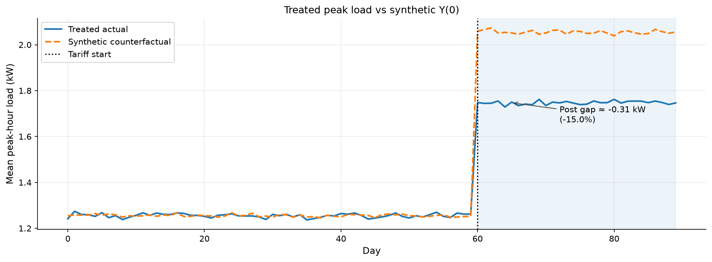
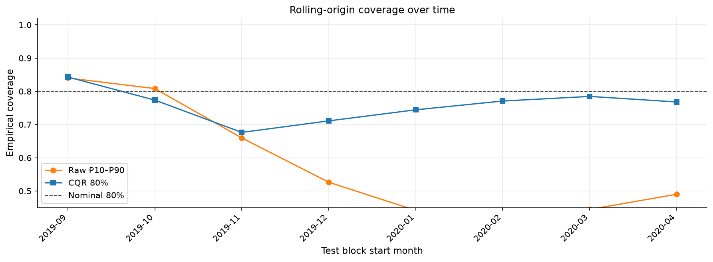

# energy-causal-conformal

**Effects and guarantees, not just predictions.**

Utilities and balancing desks constantly ask two questions that point forecasts alone cannot answer:

1. **What changed because of the intervention?** — Did the tariff actually cut peak load, or did weather move the numbers?
2. **How confident are you entitled to be?** — Does an "80% band" cover 80% of hours on a long backtest, or is reserve sized from a label that lies?

This repo makes both questions explicit, testable, and tied to decisions: rollout evidence for pilots, and contract-grade interval coverage for forecast desks.

Paste-ready narrative: [`docs/two_questions.md`](docs/two_questions.md)

---

## Two notebooks

| # | Question | Method | Evidence |
|---|---|---|---|
| **1** | Did the tariff work? | Synthetic control + placebos | Recovers injected **−15%** peak cut; naive before/after does not |
| **2** | Can you trust the intervals? | MAPIE CQR + rolling-origin backtest | Raw P10–P90 **~58%** empirical coverage; CQR **~76%** on 365-day walk |

### Notebook 1 — Did the tariff reduce peak residential load?

[`notebooks/01_synthetic_control.ipynb`](notebooks/01_synthetic_control.ipynb)

A peak-shaving tariff pilot on five homes. Synthetic control builds a donor-weighted counterfactual `Y(0)`, estimates the average treatment effect on the treated (ATT), and stress-tests with bootstrap uncertainty, in-space and in-time placebos, DiD/IPW cross-checks, and donor-pool sensitivity.

On simulated data with a **known 15% peak-load cut**, SC recovers **−0.278 kW (−15.0%)**; naive before/after is confounded by a shared weather jump. Placebo p-values put the real gap in the tail.



### Notebook 2 — Are forecast intervals trustworthy in production?

[`notebooks/02_conformal_forecast.ipynb`](notebooks/02_conformal_forecast.ipynb)

Week 3-style quantile LightGBM (pinball loss at P10/P50/P90) wrapped with MAPIE conformalized quantile regression (CQR). Chronological train → calibrate → test splits, then a **365-day rolling-origin backtest** with coverage-over-time monitoring.

On synthetic day-ahead wind (heteroskedastic tails, mid-sample drift):

| Band | Nominal | Empirical (held-out test) | Rolling mean (8 folds) |
|---|---|---|---|
| Raw P10–P90 | 80% | **76.7%** | **57.8%** |
| CQR 80% | 80% | **77.2%** | **75.9%** |

CQR pays in width (~6,400 MW vs ~4,000 MW mean band) and buys a label a reserve desk can monitor month after month.



---

## Conformal vs Bayesian intervals

| | Bayesian GP (Notebook 3 appendix) | Conformal CQR (Notebook 2) |
|---|---|---|
| **Interval meaning** | Posterior credible band (± 2σ) | Coverage-calibrated prediction interval |
| **Honesty depends on** | Kernel + noise model being right | Exchangeability + calibration set |
| **Production scale** | Demo only (~100 points, O(n³)) | Thousands of hourly rows, rolling re-calibration |

GP bands answer *"what does the model believe?"* CQR answers *"does the label match held-out frequency?"* Production reserve desks need the second. See [`notebooks/03_gp_solar.ipynb`](notebooks/03_gp_solar.ipynb) for the compressed contrast.

Concept primers: [`docs/causal_mental_model.md`](docs/causal_mental_model.md) · [`docs/conformal_mental_model.md`](docs/conformal_mental_model.md)

---

## Reproduce from a clean clone

Requires **Python 3.11+**.

```powershell
git clone https://github.com/mehmetertac/energy-causal-conformal.git
cd energy-causal-conformal
python -m venv .venv
.\.venv\Scripts\Activate.ps1
pip install -r requirements.txt
pytest tests/ -q
python scripts/run_notebooks.py
```

- **Tests:** 33 unit tests on synthetic data (no network).
- **Notebooks:** `scripts/run_notebooks.py` executes notebooks 01–03 top-to-bottom and writes summary PNGs to `results/`.
- **GP appendix:** Notebook 3 needs `torch` + `gpytorch` (already in `requirements.txt`).

Optional DiD warmup: [`notebooks/00_did_toy_warmup.ipynb`](notebooks/00_did_toy_warmup.ipynb)

---

## What this means in market terms

**Causal ATT** on load translates to peak MW avoided, wholesale energy savings, and customer bill deltas — but only if the estimate survives placebos and a CI that excludes zero.

**Forecast bands** labeled 80% that deliver ~58% empirical coverage are unpriced shortage risk. Monitor **coverage over time** the way you monitor placebo p-values before scaling a tariff.

---

## Data

| Source | Role |
|---|---|
| [Pecan Street Dataport](https://www.pecanstreet.org/dataport/) | **Intended** for Notebook 1 (registration required) |
| [Low Carbon London](https://data.london.gov.uk/dataset/smartmeter-energy-use-data-in-london-households/) | **Substitute** — dToU tariff trial vs flat-rate control, 2013 |
| Synthetic panels | Notebook 1 SC + Notebook 2 wind (reproducible, no download) |

Details: [`data/README.md`](data/README.md)

---

## Project structure

```
├── docs/
│   ├── causal_mental_model.md
│   ├── conformal_mental_model.md
│   ├── two_questions.md          Public narrative (paste-ready)
│   └── figures/                  Committed summary charts for README
├── notebooks/                    00 warmup, 01–02 capstones, 03 GP appendix
├── results/                      Generated PNGs (gitignored; on notebook run)
├── scripts/run_notebooks.py      Non-interactive smoke run for 01–03
├── src/causal/                   DiD, synthetic control, propensity IPW/DoWhy
├── src/conformal/                QuantileLGBM, MAPIE CQR, rolling backtest
├── src/plotting.py               Shared styling + figure export
├── tests/                        Unit tests (no network)
├── AGENT.md                      Agent workflow rules
└── handover.md                   Live status for the next session
```

---

## Agent / contributor workflow

Read [`AGENT.md`](AGENT.md) before making changes. Update [`handover.md`](handover.md) before every push.
